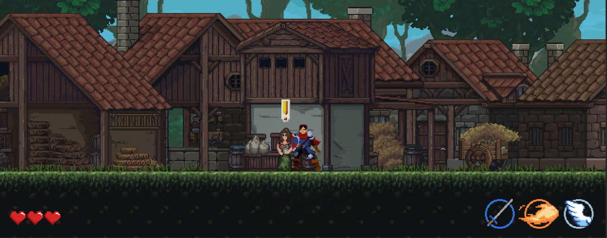
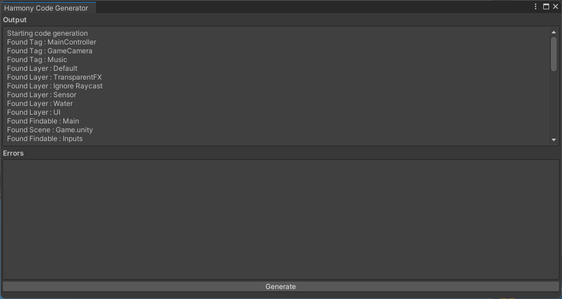
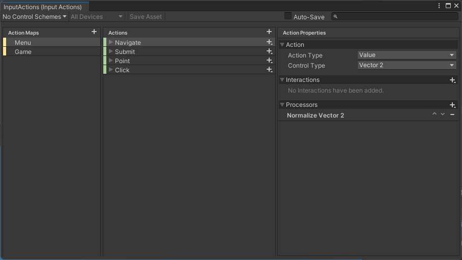

<div align="center">


# The Priest's calling

</div>

The Priest's calling est un projet scolaire réalisé par l'équipe ArcaFX sur Unity en hiver 2022 pour l'épreuve
synthèse de programme des Techniques de l'informatique du Cégep de Sainte-Foy.

Ce jeu vidéo raconte l'histoire
de Jab, un jeune du village de Oakvale. Avec sa bravoure et l'aide de son ami mystérieux le prêtre, dont il ignore le nom, 
il devra vaincre le seigneur maléfique ainsi que ses sbires pour sauver son entourage.

<div align="center">



</div>

## Installation

Téléchargez la dernière version [stable du jeu][Stable Download]. Décompressez l'archive dans un dossier et exécutez
le programme `ThePriestsCalling.exe`. Notez que vous aurez à naviguer au travers de quelques sous-dossiers. Sous Windows,
vous aurez aussi un avertissement de sécurité que vous pouvez ignorer en cliquant sur le lien *Informations 
complémentaires* de la fenêtre.

## Démarrage rapide

Ces instructions vous permettront d'obtenir une copie opérationnelle du projet sur votre machine à des fins de 
*développement*.

#### Prérequis

* [Git] - Système de contrôle de version. Utilisez la dernière version.
* [Rider] ou [Visual Studio] - IDE. Vous pouvez utiliser également n'importe quel autre IDE: assurez-vous simplement 
  qu'il supporte les projets Unity.
* [Unity 2021.2.9f1] - Moteur de jeu. Veuillez utiliser **spécifiquement cette version.** Attention à ne pas installer
  Visual Studio une seconde fois si vous avez déjà un IDE.

*Seul le développement sur Windows est complètement supporté.*

#### Compiler une version de développement

Clonez le dépôt et ouvrez le projet dans Unity. Ensuite, ouvrez la scène `MainMenu` et appuyez sur le bouton *Play*.

#### Compiler une version stable

Ouvrez le projet dans Unity. Ensuite, allez dans `File | Build Settings` et compilez le projet **dans un dossier vide**.

## Développement
<details>
<summary>Instructions</summary>

Ces instructions visent à documenter comment contribuer au développement de certaines parties du projet. Les décisions
architecturales importantes seront aussi décrites ici.

### Fichiers auto-générés

Ce projet contient une bonne quantité de code généré automatiquement. Par exemple, la classe `Tags` est générée 
automatiquement à partir des *Tags* du projet Unity. Cependant, la génération en elle-même n'est pas automatique et
doit être lancée manuellement. Pour ce faire, accédez au menu `Tools | Harmony | Code Generator`. Une fenêtre devrait
s'ouvrir où vous pourrez générer le code lorsque nécessaire. 

Il est à noter que ce code est envoyé sur le dépôt. Soyez donc prudents lors des fusions entre les différentes branches
et préférez regénéner le code en cas de doutes.

<div align="center">

  

</div>

Le générateur de code en lui-même est un exécutable externe et fait partie du *package* `Harmony`. Pour plus 
d'informations sur ce qu'il fait, consultez le [dépôt officiel][Harmony Code Generator].

### New Input System

Afin de simplifier la gestion des entrées, le [New Input System] est utilisé au lieu de celui intégré au moteur. Le 
fichier de configuration des entrées se trouve dans `Assets/Settings/InputActions`. Pour plus d'informations sur le 
nouveau *Input System*, consultez son [manuel d'utilisation][New Input System].

Il est à noter que ce fichier génère lui aussi du code C# (voir la classe `InputActions`) et que ce dernier est lui 
aussi inclus dans le dépôt. Soyez donc prudent lors des fusions.

<div align="center">

  

</div>

## Intégration Continue

Ce projet utilise [GitLab CI] pour effectuer de l'intégration continue avec les images *Docker* fournies par [GameCI].
Pour fonctionner, ces images ont besoin d'une license *Unity* valide. Cette license doit être ajouté dans la
variable d'environnement `UNITY_LICENSE` pour le projet. 

Voici comment récupérer ce fichier de license. Premièrement, dans une machine avec *Docker*, exécutez la commande 
suivant. Remplacez le contenu des variables `UNITY_USERNAME` et `UNITY_PASSWORD` par les informations de connexion
pour le compte à utiliser.

```shell
docker run -it --rm \
-e "UNITY_USERNAME=username@example.com" \
-e "UNITY_PASSWORD=example_password" \
-e "TEST_PLATFORM=linux" \
unityci/editor:2021.2.9f1-base-0.16.1 \
bash
```

Une fois dans le *Docker*, exécutez cette commande :

```shell
xvfb-run --auto-servernum --server-args='-screen 0 640x480x24' \
unity-editor \
-logFile /dev/stdout \
-batchmode \
-nographics \
-username "$UNITY_USERNAME" -password "$UNITY_PASSWORD"
```

Dans la sortie du programme, au bout d'un certain temps, vous devriez trouver quelque chose qui ressemble à ceci :

```text
LICENSE SYSTEM [2017723 8:6:38] Posting <?xml version="1.0" encoding="UTF-8"?><root><SystemInfo><IsoCode>en</IsoCode><UserName>[...]
```

Copiez la partie *XML* dans un fichier nommé `unity3d.alf`. Utilisez ce fichier pour effectuer l'activation manuelle
sur le site de Unity (voir `https://license.unity3d.com/manual`). En retour, vous obtiendrez un fichier 
`Unity_v2021.x.ulf` dont le contenu doit être mis dans la variable `UNITY_LICENSE` du projet.

</details>

## Tester le projet

Vous êtes fortement encouragés à tester [la dernière version][Develop Download] de développement du jeu. Si vous 
rencontrez un bogue, vous êtes priés de le [signaler][Submit Bug] et de fournir une explication détaillée du problème 
avec les étapes pour le reproduire. Les captures d'écran et les vidéos sont les bienvenues.

## Contribuer au projet

Veuillez lire [CONTRIBUTING.md](CONTRIBUTING.md) pour plus de détails sur notre code de conduite.

## Auteurs

* **Adam Boukhari** - *Programmeur*
* **Manuel Chastenay** - *Programmeur*
* **Jérémy Delisle** - *Programmeur*
* **Gabriel Dutil** - *Programmeur*
* **Jennifer Terencio** - *Programmeuse*

## Remerciements

* [GameCI] - Images Docker d'intégration continue pour *Unity*.
* Générateur de code. Voir [le dépôt][Harmony Code Generator] pour plus d'informations.

[//]: # (Hyperliens)
[Git]: https://git-scm.com/downloads
[Rider]: https://www.jetbrains.com/rider/
[Visual Studio]: https://www.visualstudio.com/fr/
[Unity 2021.2.9f1]: https://unity3d.com/fr/get-unity/download/
[Harmony Code Generator]: https://gitlab.com/harmony-unity/code-generator
[New Input System]: https://docs.unity3d.com/Packages/com.unity.inputsystem@1.0/manual/index.html
[GitLab CI]: https://docs.gitlab.com/ee/ci/
[GameCI]: https://game.ci/
[Submit Bug]: https://gitlab.com/a8391/the-priest-s-calling/issues/new?issuable_template=Bug
[Stable Download]: https://gitlab.com/a8391/the-priest-s-calling/-/jobs/artifacts/main/download?job=build
[Develop Download]: https://gitlab.com/a8391/the-priest-s-calling/-/jobs/artifacts/develop/download?job=build
